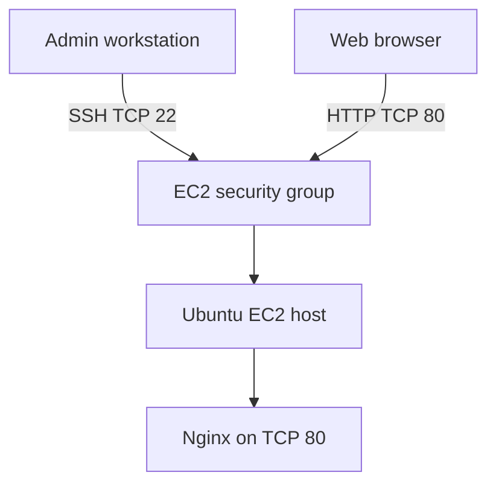

# AWS Linux Support Triage Lab

A hands-on Linux troubleshooting and server-security lab built on a regular Ubuntu EC2 virtual machine. The exercises model first-response work for a cloud technical support team: verify impact, inspect the right system layer, collect evidence, restore service, and communicate clearly.

> **Status:** Initial Nginx deployment and baseline checks are complete. Controlled incident exercises are planned and will be added as they are performed.

## Goals

- Practice Linux command-line investigation on a cloud VM.
- Distinguish host, service, DNS, firewall, permissions, and storage symptoms.
- Review SSH, host firewall, user access, and AppArmor security without risking remote access.
- Write concise incident notes and customer updates.

## Architecture

SSH and HTTP pass through the EC2 security group before reaching Ubuntu. Ubuntu's host firewall, if enabled, is a separate layer. The SSH rule should be limited to the administrator's current IP address.

## Environment

- AWS EC2 virtual machine
- Ubuntu Server 24.04 LTS
- Nginx 1.28.3 (Ubuntu package)
- Nginx serves the default welcome page over HTTP
- Docker is not used in this project

No AWS account ID, public IP, private key, or credentials are included in this repository.

## Completed baseline verification

The following checks were completed on October 5, 2026:

| Check | Result |
|---|---|
| `sudo nginx -t` | Configuration syntax is valid; test successful |
| `sudo systemctl status nginx --no-pager` | `nginx.service` is active and running |
| `sudo ss -lntp \| grep ':80'` | Nginx listens on `0.0.0.0:80` and `[::]:80` |
| `curl -I http://localhost` | `HTTP/1.1 200 OK` |
| Browser test from workstation | Nginx welcome page loaded through the instance's public endpoint |

These checks establish a working baseline. A service outage exercise has not yet been recorded.

## Troubleshooting method

For every incident, record:

1. **Impact and scope:** what fails, who is affected, and when it began.
2. **Evidence:** command, timestamp, and relevant output.
3. **Layer checked:** cloud/network path, host, service, DNS, access, or storage.
4. **Finding:** distinguish confirmed cause from hypothesis.
5. **Action and verification:** what changed and how recovery was confirmed.
6. **Communication:** customer update and escalation details, if needed.

## Planned exercises

- **Nginx unavailable:** inspect service state, logs, listener, and local HTTP response; restore the service and verify externally.
- **Host firewall blocks HTTP:** compare UFW and EC2 security-group rules; restore the HTTP rule.
- **DNS lookup failure:** compare a valid hostname with a controlled nonexistent hostname; do not rewrite resolver configuration.
- **Permission denied:** inspect a test file's owner and mode and explain the access result.
- **Disk and resource review:** inspect filesystem capacity, inodes, logs, memory, and processes without filling the root volume.
- **Security review:** inspect SSH settings, users/groups, UFW status, and AppArmor status. Test AppArmor policy changes only in complain mode first and verify Nginx afterward.

## Safety notes

- Keep SSH restricted to your own IP and ensure SSH is allowed before enabling UFW.
- Do not publish `.pem` files, credentials, AWS account IDs, public addresses, or unredacted console screenshots.
- Do not flush firewall rules, change the SSH port, migrate Ubuntu to SELinux, fill the root disk, or restart networking while relying on one remote SSH session.
- Use the EC2 console as a recovery path for remote-access changes.
- Stop or terminate the instance when the lab is complete. Stopping ends instance compute usage charges, while EBS storage can continue to incur charges; check AWS Billing for current charges.

## Project status

This repository is being built incrementally. Each incident report will be added only after the exercise has been run and its recovery verified.
